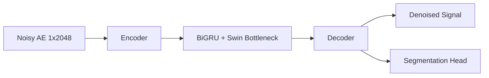

# Architecture Summary

## MR-TAE-FULL

- **Model ID:** `MR-TAE-FULL`
- **Core idea:** U-Net style 1D denoiser with BiGRU + Swin-like bottleneck, attention-gated skips, and MTL head.
- **Use when:** robustness is prioritized over latency.

## Ablation Variants

- `MR-TAE-noBiGRU`: Swin-only bottleneck.
- `MR-TAE-noSwin`: BiGRU-only bottleneck.
- `MR-TAE-noAttn`: plain skip concatenation.
- `MR-TAE-noMTL`: denoising-only mode.
- `MR-TAE-noWavelet`: maxpool/transpose conv path.

## Cross-Combination Variants

- `MWCNN-BiGRU`
- `MWCNN-Swin`
- `UNet-BiGRU-Swin`
- `UNet-BiGRU`
- `UNet-Attn`

## Notes

- All variants inherit `BaseDenoiser`.
- Shared blocks live under `models/components/`.
- Parameter counts are available per model via `get_parameter_count()`.
