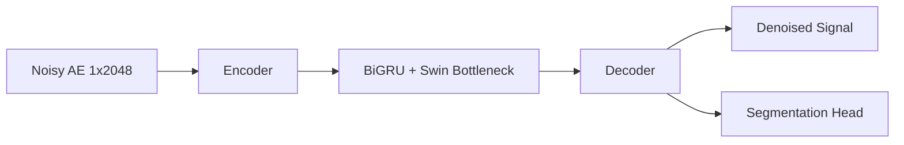

# Architecture Summary

All production variants use **`GenericUNetDenoiser`** (`models/variants.py`): three encoder levels, optional **BiGRU** + **Swin-like** bottleneck, optional **attention-gated skips**, **MTL** segmentation head (`use_mtl`).

## Shared skeleton (ASCII)

```
x [B,1,L] ──► enc1 ──► down ──► enc2 ──► down ──► enc3 ──► bottleneck
                      │                    │
                      └──── skip2 ◄────────┘
                                                           ...
                      └──── skip1 ◄──────── dec2 ◄── up2
dec1 ◄── up1 ◄── ... ◄── decoder
   ├──► out  (1 ch denoise)
   └──► seg  (4 ch logits if MTL else zeros)
```

## Per model (registry IDs)

| Model ID | Bottleneck | Skips | MTL | Notes |
|----------|------------|-------|-----|--------|
| `MR-TAE-FULL` | BiGRU + Swin | Attn gates | Yes | Full stack |
| `MR-TAE-noBiGRU` | Swin only | Attn | Yes | Tests recurrent path |
| `MR-TAE-noSwin` | BiGRU only | Attn | Yes | Tests spectral/local stack |
| `MR-TAE-noAttn` | BiGRU + Swin | Concat | Yes | Attention ablation |
| `MR-TAE-noMTL` | BiGRU + Swin | Attn | **No** | Denoise-only (`seg` stub) |
| `MR-TAE-noWavelet` | BiGRU + Swin | Attn | Yes | Wavelet front-end off (uses plain conv path per config) |
| `MWCNN-BiGRU` | BiGRU | varies | per flags | Cross combo |
| `MWCNN-Swin` | Swin | varies | per flags | Cross combo |
| `UNet-BiGRU-Swin` | BiGRU+Swin | varies | per flags | Naming alias for full fusion |
| `UNet-BiGRU` | BiGRU | varies | per flags | UNet + recurrent |
| `UNet-Attn` | Attn bottleneck | Attn | per flags | Attention-heavy |

**Parameter counts** — `sum(p.numel() for p in model.parameters())` or benchmark `param_count_M`.

**Loss** — `MultiTaskLoss` in `mr_tae_fusion/training/losses.py`: Charbonnier reconstruction + CE + Generalized Dice on segmentation; learnable uncertainty weights on tasks. `charbonnier_eps` is tunable via `config/training_config.yaml` and **Optuna** (`hpo/optuna_study.py`).

## MR-TAE-FULL (reference)

- **Model ID:** `MR-TAE-FULL`
- **Core idea:** U-Net 1D denoiser with BiGRU + Swin-like bottleneck, gated skips, MTL head.



## Notes

- Checkpoints: `results/<MODEL_ID>/checkpoints/best.pt` (keys may include `model_state` or `model_state_dict`).
- Frozen test tensors: `data/test_synthetic_ae.pt`, `data/test_real_qlin.pt` — see `docs/TEST_SET_HASHES.md`.
